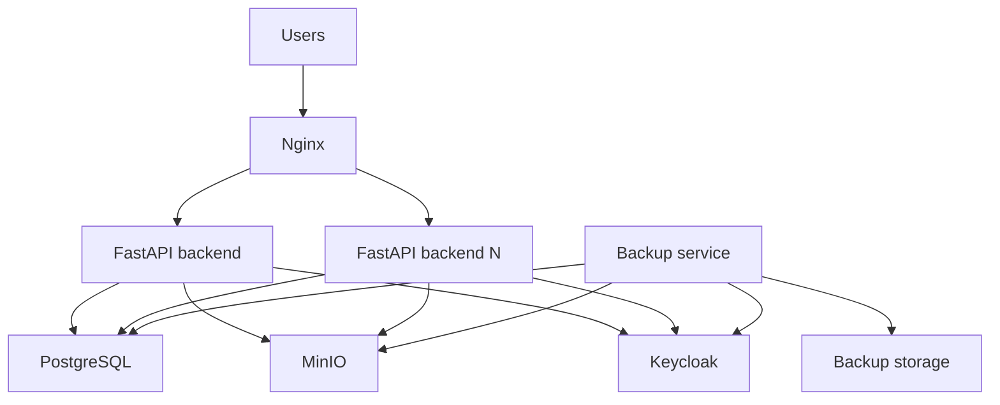

# Масштабирование

RTK EduFlow остаётся modular monolith: экземпляры FastAPI используют общие PostgreSQL, MinIO, Keycloak и Redis. Состояние пользовательской сессии находится в JWT Keycloak, а файлы — в MinIO; поэтому API не требует sticky sessions.



Эволюция при дальнейшем росте: Docker Compose → Nginx + Backend N → K3s → Kubernetes deployment. K3s и Kubernetes сейчас не разворачиваются.

Обычная разработка использует один backend напрямую:

```bash
make dev
```

Демонстрация запускает Nginx и несколько backend без публикации их портов на хост:

```bash
BACKEND_REPLICAS=3 make demo
```

API и Swagger в demo доступны через `http://localhost:8088`; frontend автоматически получает этот URL. Nginx передаёт Authorization и forwarding-заголовки. K3s/Kubernetes не входят в текущую реализацию: они имеют смысл после появления требований к оркестрации, отказоустойчивой БД и наблюдаемости.

Для демонстрации распределения запросов временно включите `ENABLE_DIAGNOSTIC_HEADERS=true`; ответы будут содержать `X-Backend-Instance`. По умолчанию заголовок выключен и внутренние имена контейнеров не раскрываются.

Пул каждого backend ограничен `DB_POOL_SIZE + DB_MAX_OVERFLOW`. При росте replicas суммарное число соединений должно оставаться ниже лимита PostgreSQL.
